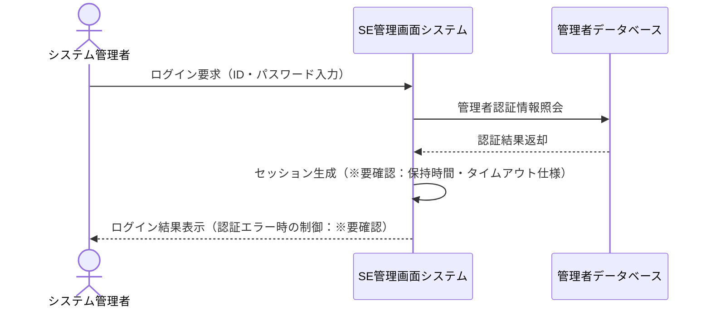
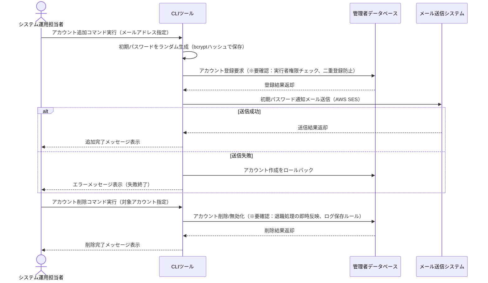
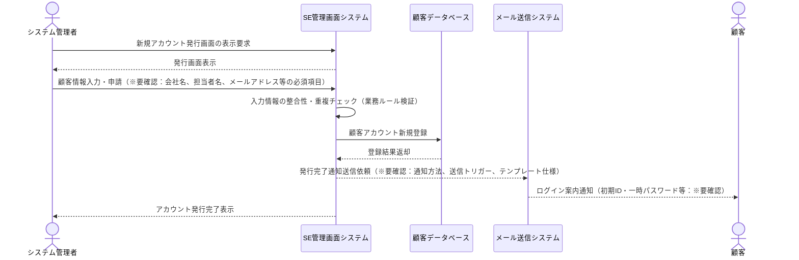
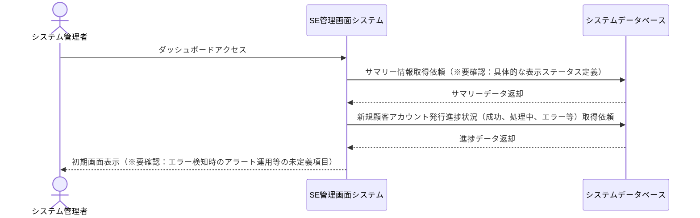

# 業務フロー

> バージョン: 2 | 更新日時: 2026/7/12 0:00:00

## 認証・ログイン管理

システム管理者がSE管理画面にログインし、セッションを開始する一連の業務フロー。※要確認：セキュリティ運用ルール、タイムアウト仕様の詳細

**参加者:** システム管理者 (actor)、SE管理画面システム (system)、管理者データベース (database)

**メッセージフロー:**
- システム管理者 → SE管理画面システム: ログイン要求（ID・パスワード入力）
- SE管理画面システム → 管理者データベース: 管理者認証情報照会
  - 管理者データベース ← SE管理画面システム: 認証結果返却
- SE管理画面システム → SE管理画面システム: セッション生成（※要確認：保持時間・タイムアウト仕様）
  - SE管理画面システム ← システム管理者: ログイン結果表示（認証エラー時の制御：※要確認）

## SE管理ユーザー管理

システム運用担当者が専用のCLIツールを用いて、SE管理者アカウントの追加および削除を行う業務フロー。

**参加者:** システム運用担当者 (actor)、CLIツール (system)、管理者データベース (database)、メール送信システム (external)

**メッセージフロー:**
- システム運用担当者 → CLIツール: アカウント追加コマンド実行（メールアドレス指定）
- CLIツール → CLIツール: 初期パスワードをランダム生成（bcrypt ハッシュで保存）
- CLIツール → 管理者データベース: アカウント登録要求（※要確認：実行者権限チェック、二重登録防止）
  - 管理者データベース ← CLIツール: 登録結果返却
- CLIツール → メール送信システム: 初期パスワード通知メール送信（AWS SES）
  - 送信成功時: CLIツール ← システム運用担当者: 追加完了メッセージ表示
  - 送信失敗時: CLIツール → 管理者データベース: アカウント作成をロールバックし、CLI は失敗終了
- システム運用担当者 → CLIツール: アカウント削除コマンド実行（対象アカウント指定）
- CLIツール → 管理者データベース: アカウント削除/無効化（※要確認：退職処理の即時反映、ログ保存ルール）
  - 管理者データベース ← CLIツール: 削除結果返却
  - CLIツール ← システム運用担当者: 削除完了メッセージ表示

## 顧客アカウント管理

システム管理者がSE管理画面から顧客の新規アカウントを発行し、顧客への通知を行う業務フロー。

**参加者:** システム管理者 (actor)、SE管理画面システム (system)、顧客データベース (database)、メール送信システム (external)、顧客 (actor)

**メッセージフロー:**
- システム管理者 → SE管理画面システム: 新規アカウント発行画面の表示要求
  - SE管理画面システム ← システム管理者: 発行画面表示
- システム管理者 → SE管理画面システム: 顧客情報入力・申請（※要確認：会社名、担当者名、メールアドレス等の必須項目）
- SE管理画面システム → SE管理画面システム: 入力情報の整合性・重複チェック（業務ルール検証）
- SE管理画面システム → 顧客データベース: 顧客アカウント新規登録
  - 顧客データベース ← SE管理画面システム: 登録結果返却
- SE管理画面システム → メール送信システム: 発行完了通知送信依頼（※要確認：通知方法、送信トリガー、テンプレート仕様）
- メール送信システム → 顧客: ログイン案内通知（初期ID・一時パスワード等：※要確認）
  - SE管理画面システム ← システム管理者: アカウント発行完了表示

## ダッシュボード管理

ログイン後にシステム稼働サマリーや顧客アカウント発行状況を監視し、業務状況を把握するフロー。

**参加者:** システム管理者 (actor)、SE管理画面システム (system)、システムデータベース (database)

**メッセージフロー:**
- システム管理者 → SE管理画面システム: ダッシュボードアクセス
- SE管理画面システム → システムデータベース: サマリー情報取得依頼（※要確認：具体的な表示ステータス定義）
  - システムデータベース ← SE管理画面システム: サマリーデータ返却
- SE管理画面システム → システムデータベース: 新規顧客アカウント発行進捗状況（成功、処理中、エラー等）取得依頼
  - システムデータベース ← SE管理画面システム: 進捗データ返却
  - SE管理画面システム ← システム管理者: 初期画面表示（※要確認：エラー検知時のアラート運用等の未定義項目）

