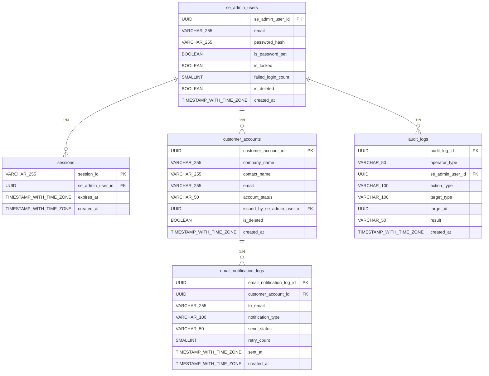

# ER図

> バージョン: 1 | 更新日時: 2026/7/1 22:14:51

SE管理画面システムのER図。SE管理者の認証・セッション管理、顧客アカウント発行、操作監査ログ、メール送信ログの5テーブルで構成される。audit_logsのse_admin_user_idはCLI操作時にNULLとなるため厳密な外部キー制約は※要確認。

### エンティティ一覧

**SE_ADMIN_USERS**

| カラム名 | データ型 | キー |
| --- | --- | --- |
| se_admin_user_id | UUID | PK |
| email | VARCHAR(255) |  |
| password_hash | VARCHAR(255) |  |
| is_password_set | BOOLEAN |  |
| is_locked | BOOLEAN |  |
| failed_login_count | SMALLINT |  |
| is_deleted | BOOLEAN |  |
| created_at | TIMESTAMP WITH TIME ZONE |  |

**SESSIONS**

| カラム名 | データ型 | キー |
| --- | --- | --- |
| session_id | VARCHAR(255) | PK |
| se_admin_user_id | UUID | FK |
| expires_at | TIMESTAMP WITH TIME ZONE |  |
| created_at | TIMESTAMP WITH TIME ZONE |  |

**CUSTOMER_ACCOUNTS**

| カラム名 | データ型 | キー |
| --- | --- | --- |
| customer_account_id | UUID | PK |
| company_name | VARCHAR(255) |  |
| contact_name | VARCHAR(255) |  |
| email | VARCHAR(255) |  |
| account_status | VARCHAR(50) |  |
| issued_by_se_admin_user_id | UUID | FK |
| is_deleted | BOOLEAN |  |
| created_at | TIMESTAMP WITH TIME ZONE |  |

**AUDIT_LOGS**

| カラム名 | データ型 | キー |
| --- | --- | --- |
| audit_log_id | UUID | PK |
| operator_type | VARCHAR(50) |  |
| se_admin_user_id | UUID | FK |
| action_type | VARCHAR(100) |  |
| target_type | VARCHAR(100) |  |
| target_id | UUID |  |
| result | VARCHAR(50) |  |
| created_at | TIMESTAMP WITH TIME ZONE |  |

**EMAIL_NOTIFICATION_LOGS**

| カラム名 | データ型 | キー |
| --- | --- | --- |
| email_notification_log_id | UUID | PK |
| customer_account_id | UUID | FK |
| to_email | VARCHAR(255) |  |
| notification_type | VARCHAR(100) |  |
| send_status | VARCHAR(50) |  |
| retry_count | SMALLINT |  |
| sent_at | TIMESTAMP WITH TIME ZONE |  |
| created_at | TIMESTAMP WITH TIME ZONE |  |

### リレーション

- SE_ADMIN_USERS → SESSIONS (1:N)
- SE_ADMIN_USERS → CUSTOMER_ACCOUNTS (1:N)
- SE_ADMIN_USERS → AUDIT_LOGS (1:N)
- CUSTOMER_ACCOUNTS → EMAIL_NOTIFICATION_LOGS (1:N)

### ER図

