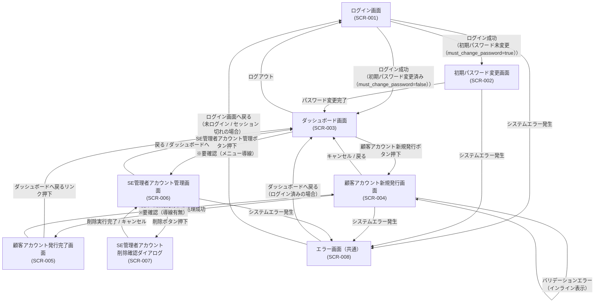

# 画面遷移

> バージョン: 2 | 更新日時: 2026/7/12 0:00:00

SE管理画面システムの画面遷移図。ログイン画面を起点とし、初期パスワード未変更（must_change_password=true）の場合は初期パスワード変更画面を経由してダッシュボードへ遷移する。ダッシュボードからは顧客アカウント新規発行フローおよびSE管理者アカウント管理画面へ遷移できる。顧客アカウント発行は入力→完了の2ステップ構成。SE管理者アカウント削除は一覧画面上のモーダルダイアログで確認後実行。システムエラー発生時は共通エラー画面へ遷移し、ログイン状態に応じてダッシュボードまたはログイン画面へ復帰できる。

**フロー:**
- ログイン画面
(SCR-001) → 初期パスワード変更画面
(SCR-002) (ログイン成功
（初期パスワード未変更（must_change_password=true））)
- ログイン画面
(SCR-001) → ダッシュボード画面
(SCR-003) (ログイン成功
（初期パスワード変更済み（must_change_password=false））)
- ログイン画面
(SCR-001) → エラー画面（共通）
(SCR-008) (システムエラー発生)
- 初期パスワード変更画面
(SCR-002) → ダッシュボード画面
(SCR-003) (パスワード変更完了)
- 初期パスワード変更画面
(SCR-002) → エラー画面（共通）
(SCR-008) (システムエラー発生)
- ダッシュボード画面
(SCR-003) → 顧客アカウント新規発行画面
(SCR-004) (顧客アカウント新規発行ボタン押下)
- ダッシュボード画面
(SCR-003) → SE管理者アカウント管理画面
(SCR-006) (SE管理者アカウント管理ボタン押下
※要確認（メニュー導線）)
- ダッシュボード画面
(SCR-003) → ログイン画面
(SCR-001) (ログアウト)
- 顧客アカウント新規発行画面
(SCR-004) → 顧客アカウント発行完了画面
(SCR-005) (登録処理成功)
- 顧客アカウント新規発行画面
(SCR-004) → 顧客アカウント新規発行画面
(SCR-004) (バリデーションエラー
（インライン表示）)
- 顧客アカウント新規発行画面
(SCR-004) → ダッシュボード画面
(SCR-003) (キャンセル / 戻る)
- 顧客アカウント新規発行画面
(SCR-004) → エラー画面（共通）
(SCR-008) (システムエラー発生)
- 顧客アカウント発行完了画面
(SCR-005) → ダッシュボード画面
(SCR-003) (ダッシュボードへ戻るリンク押下)
- 顧客アカウント発行完了画面
(SCR-005) → 顧客アカウント新規発行画面
(SCR-004) (続けて新規発行する
※要確認（導線有無）)
- SE管理者アカウント管理画面
(SCR-006) → SE管理者アカウント
削除確認ダイアログ
(SCR-007) (削除ボタン押下)
- SE管理者アカウント管理画面
(SCR-006) → ダッシュボード画面
(SCR-003) (戻る / ダッシュボードへ)
- SE管理者アカウント管理画面
(SCR-006) → エラー画面（共通）
(SCR-008) (システムエラー発生)
- SE管理者アカウント
削除確認ダイアログ
(SCR-007) → SE管理者アカウント管理画面
(SCR-006) (削除実行完了 / キャンセル)
- エラー画面（共通）
(SCR-008) → ダッシュボード画面
(SCR-003) (ダッシュボードへ戻る
（ログイン済みの場合）)
- エラー画面（共通）
(SCR-008) → ログイン画面
(SCR-001) (ログイン画面へ戻る
（未ログイン / セッション切れの場合）)

