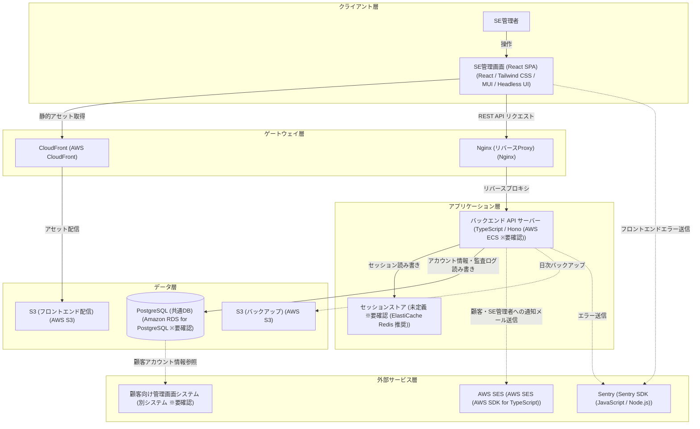

# アーキテクチャ構成図

> バージョン: 2 | 更新日時: 2026/7/12 0:00:00

SE担当者専用の独立したWebアプリケーション。顧客向け管理画面とは完全分離し、AWSクラウド上で稼働するREST APIベースのシステム構成。

**クライアント層:**
- SE管理者
- SE管理画面 (React SPA) [React / Tailwind CSS / MUI / Headless UI]

**ゲートウェイ層:**
- CloudFront [AWS CloudFront]
- Nginx (リバースProxy) [Nginx]

**アプリケーション層:**
- バックエンド API サーバー [TypeScript / Hono (AWS ECS ※要確認)]
- セッションストア [未定義 ※要確認 (ElastiCache Redis 推奨)]

**データ層:**
- S3 (フロントエンド配信) [AWS S3]
- PostgreSQL (共通DB) [Amazon RDS for PostgreSQL ※要確認]
- S3 (バックアップ) [AWS S3]

**外部サービス層:**
- AWS SES [AWS SES (AWS SDK for TypeScript)]
- Sentry [Sentry SDK (JavaScript / Node.js)]
- 顧客向け管理画面システム [別システム ※要確認]

**接続:**
- SE管理者 → SE管理画面 (React SPA) (HTTPS)
- SE管理画面 (React SPA) → CloudFront (HTTPS)
- CloudFront → S3 (フロントエンド配信) (HTTPS)
- SE管理画面 (React SPA) → Nginx (リバースProxy) (HTTPS)
- Nginx (リバースProxy) → バックエンド API サーバー (HTTP)
- バックエンド API サーバー → セッションストア (Redis ※要確認)
- バックエンド API サーバー → PostgreSQL (共通DB) (SQL (TLS))
- バックエンド API サーバー → AWS SES (HTTPS (AWS SDK))
- バックエンド API サーバー → S3 (バックアップ) (HTTPS (AWS SDK))
- バックエンド API サーバー → Sentry (HTTPS (Sentry SDK))
- SE管理画面 (React SPA) → Sentry (HTTPS (Sentry SDK))
- PostgreSQL (共通DB) → 顧客向け管理画面システム (SQL (共通DBスキーマ共有))

